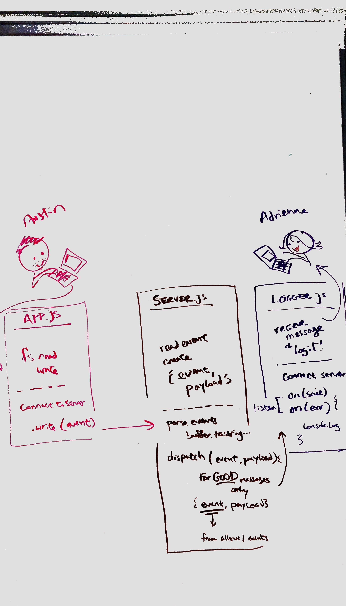

# LAB - 17
​
## TCP Server / Message Application
​
### Author: Brandyn Vay
​
### Links and Resources
* [submission PR](https://github.com/brandyn-vay-401-advanced-javascript/lab-class-17)
* [travis](https://travis-ci.com/brandyn-vay-401-advanced-javascript/lab-class-17)
​
#### Documentation
* [jsdoc](http://xyz.com) (Server assignments)
​
### Modules
#### `app.js`
#### `server.js`
#### `logger.js`
​
##### Exported Values and Methods
​
###### `fs.read(file) -> string`
uppercase
​
###### `fs.write(write) -> string`
saved
​
### Setup
#### `.env` requirements
* `PORT` - 3001
​
#### Running the app
* `node app.js 'files/test.txt'` - to run read/write fs
* `node server.js` - run server
* `nc localhost` - talk to the server
  
#### UML

